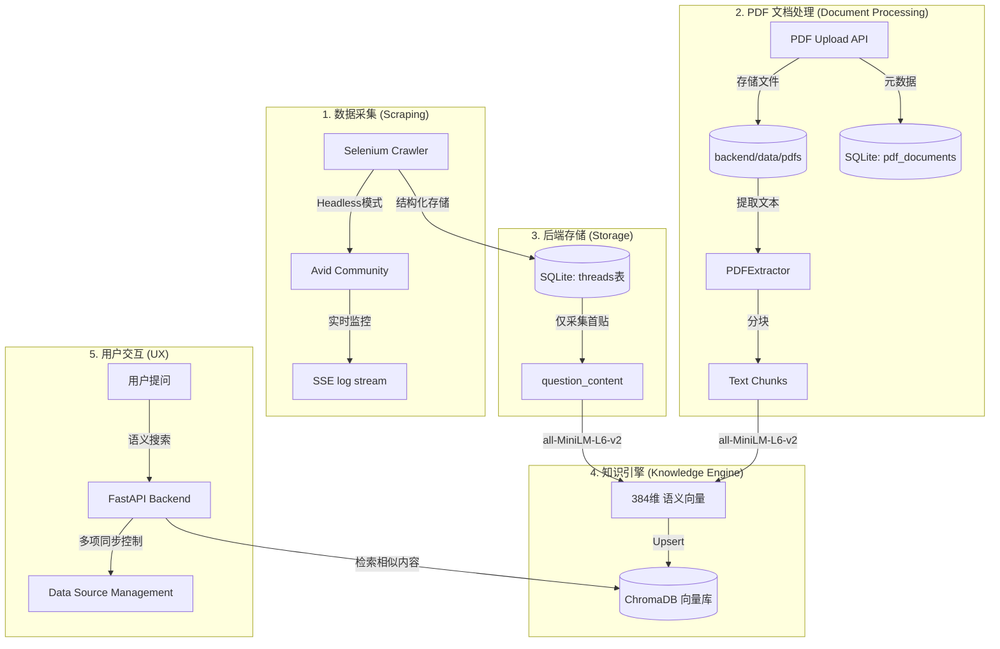
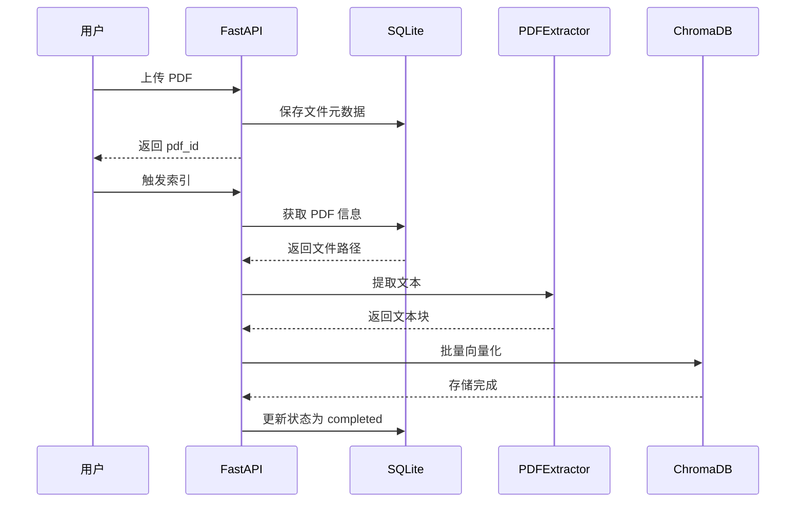

# Avid Media Composer Knowledge Base (RAG)

这是一个基于 **RAG (Retrieval-Augmented Generation / 检索增强生成)** 技术构建的本地知识库系统，专门为 Avid Media Composer 用户提供技术支持。

该系统通过自动化爬虫从 Avid 官方社区获取 20+ 个专业版块的精华讨论，并利用语义向量化技术实现极致精准的故障排除搜索。

## 🏗 技术架构与流程

系统的核心逻辑遵循"采集 -> 结构化 -> 向量化 -> 检索"的流水线：



### 技术栈详细

*   **前端 (Frontend)**
    *   **框架**: [Next.js 14](https://nextjs.org/) (App Router, TypeScript)
    *   **实时更新**: Server-Sent Events (SSE) 协议，实现无刷新的爬虫日志同步。
    *   **UI/UX**: Tailwind CSS 打造的深色模式、玻璃拟态细节。

*   **后端 (Backend)**
    *   **核心 API**: [FastAPI](https://fastapi.tiangolo.com/) (Python 3.9+)
    *   **并发管理**: 特制的线程任务管理器，支持多端、多任务并发控制。

*   **数据检索与 AI (RAG & Search)**
    *   **语义模型**: `all-MiniLM-L6-v2` (Sentence-Transformers)。它像翻译官一样，将技术术语转化为机器可比对的数学坐标（384 维向量）。
    *   **向量库**: [ChromaDB](https://www.trychroma.com/)。负责毫米级的语义检索。
    *   **自动化抓取**: Selenium WebDriver (Headless Chrome)，具备秒级响应的**取消机制**和自动重试功能。
    *   **PDF 文档处理**:
        *   **pdfplumber**: 高质量 PDF 文本提取，支持多页文档的批量处理
        *   **智能分块**: 基于句子边界的自适应文本分割（默认 1000 字符/块，200 字符重叠）
        *   **向量化**: PDF 文本块自动转换为 384 维向量，支持语义检索

## 📂 项目结构

```text
├── backend/
│   ├── api/                # 后端 API (TaskManager, SSE, Endpoints)
│   │   └── main.py         # PDF 上传/索引/删除接口
│   ├── crawler/            # 爬虫引擎 (Selenium, db_schema)
│   ├── ingest/             # 向量化流程
│   │   ├── pdf_extractor.py      # PDF 文本提取和分块
│   │   ├── vector_store.py       # ChromaDB 向量化存储
│   │   └── doc_processor.py      # 文档处理工具
│   ├── database/           # 数据库管理
│   │   └── pdf_schema.py   # PDF 数据表结构
│   └── data/
│       └── pdfs/           # PDF 文件存储目录
├── frontend/               # Next.js 极简风格 UI
├── data/
│   └── chroma_db/          # 向量数据库存储目录
└── test_pdf.py             # PDF 功能测试脚本
```

## 🚀 核心功能亮点

1.  **多源数据同步**: 在 `Settings` 页面可以对 20 多个论坛分区进行独立管理。
2.  **增量更新 (Incremental)**: 爬虫会自动比对帖子的 `Last Post Date`，仅抓取新出现的内容，大幅节省资源。
3.  **秒级取消控制**: 后端集成了信号量与超时机制，确保用户点击"取消"后，复杂的抓取任务能在秒级内安全中止。
4.  **实时控制台**: 即使在抓取 30,000+ 条数据时，用户也可以通过前端的实时控制台观察爬虫的每一个动作。
5.  **PDF 文档智能处理**:
    -   **文本提取**: 使用 pdfplumber 高质量提取 PDF 文本，支持多页文档
    -   **智能分块**: 基于句子边界的自适应分割，保持语义完整性（默认 1000 字符/块，200 字符重叠）
    -   **语义向量化**: PDF 文本块自动转换为 384 维向量，支持精准语义检索
    -   **实时索引**: 通过 SSE 协议实时展示索引进度，支持取消操作
    -   **完整管理**: 支持上传、索引、搜索、删除全流程管理

## �️ 快速开始

1.  **启动后端**:
    ```bash
    python3 backend/api/main.py
    ```
    (默认运行在 http://localhost:8000)

2.  **启动前端**:
    ```bash
    cd frontend && npm run dev
    ```
    (默认运行在 http://localhost:3000)

3.  **抓取数据**:
    进入 `Settings` 页面，点击任意版块的 `Update Now` 开始同步。

4.  **上传 PDF 文档**:
    ```bash
    # 方式 1: 通过 API 上传
    curl -X POST http://localhost:8000/pdf/upload \
         -F "file=@your_document.pdf"

    # 方式 2: 使用测试脚本
    python3 test_pdf.py
    ```

5.  **索引 PDF 文档**:
    上传后自动触发索引，或通过 API 手动触发：
    ```bash
    curl -X POST http://localhost:8000/pdf/{pdf_id}/index
    ```

6.  **搜索内容**:
    通过前端搜索功能，系统会自动检索论坛帖子和 PDF 文档中的相关内容。

---
> [!TIP]
> **关于 LLM**:
> 目前系统完成了 RAG 架构中最重要的"知识入库"与"语义检索"部分。
> 在 `Settings` 页面预留了 LLM (GPT-4 / Gemini) 的接口配置，可接入生成模块以实现完整的文档问答功能。

## 📄 PDF 文档处理详解

### 核心组件

#### 1. PDFExtractor - 文本提取器

位置：`backend/ingest/pdf_extractor.py`

```python
class PDFExtractor:
    def __init__(self, pdf_path: str, chunk_size: int = 1000, chunk_overlap: int = 200)
    def extract_text(self) -> List[Dict]  # 提取并分块
    def _clean_text(self, text: str) -> str  # 清理文本
    def _split_text(self, text: str) -> List[str]  # 智能分块
```

**工作流程**：
1. 使用 pdfplumber 打开 PDF 文件
2. 逐页提取文本内容
3. 清理文本（移除多余空白、噪音）
4. 基于句子边界进行智能分块（1000 字符/块，200 字符重叠）
5. 为每个块生成唯一 ID 和元数据

#### 2. vector_store - 向量化存储

位置：`backend/ingest/vector_store.py`

**核心函数**：
- `ingest_pdf_chunks(pdf_id: int)`: 将 PDF 文本块向量化存储到 ChromaDB
  - 批量处理（每批 100 个 chunk）
  - 使用 all-MiniLM-L6-v2 模型生成 384 维向量
  - 实时日志回调支持

- `delete_pdf_from_chroma(pdf_id: int)`: 从向量数据库删除 PDF

#### 3. pdf_schema - 数据库管理

位置：`backend/database/pdf_schema.py`

**数据表结构**：

```sql
CREATE TABLE pdf_documents (
    id INTEGER PRIMARY KEY AUTOINCREMENT,
    filename TEXT UNIQUE NOT NULL,
    original_name TEXT NOT NULL,
    file_path TEXT NOT NULL,
    file_size INTEGER,
    total_pages INTEGER,
    total_chunks INTEGER,
    upload_date TEXT DEFAULT CURRENT_TIMESTAMP,
    last_indexed TEXT,
    indexing_status TEXT DEFAULT 'pending',
    error_message TEXT,
    doc_type TEXT DEFAULT 'manual'
)
```

**状态流转**：
`pending` → `processing` → `completed` / `failed`

### API 接口

| 端点 | 方法 | 描述 |
|------|------|------|
| `/pdf/upload` | POST | 上传 PDF 文件 |
| `/pdf/list` | GET | 获取所有 PDF 列表 |
| `/pdf/{pdf_id}/index` | POST | 触发索引任务 |
| `/pdf/indexing/progress/{pdf_id}` | GET | SSE 流式索引进度 |
| `/pdf/{pdf_id}` | DELETE | 删除 PDF |

### 测试脚本

位置：`test_pdf.py` (根目录)

**功能**：
- ✅ 后端连接检测
- ✅ PDF 列表查询
- ✅ PDF 上传测试
- ✅ 索引任务启动
- ✅ 索引进度监控（超时保护 30 秒）
- ✅ 搜索功能验证
- ✅ 数据清理

**使用方法**：
```bash
# 准备测试 PDF
cp your_test.pdf test_sample.pdf

# 运行完整测试
python3 test_pdf.py
```

### 工作流程



### 技术细节

**文本分块策略**：
- 默认块大小：1000 字符
- 块重叠：200 字符（保证上下文连贯性）
- 分割边界：优先在句号、问号、感叹号处分割
- 最小块大小：50 字符（过滤噪音）

**元数据存储**：
每个文本块包含丰富的元数据：
```python
{
    "id": "pdf_<md5_hash>",
    "content": "文本内容",
    "metadata": {
        "source": "pdf",
        "filename": "document.pdf",
        "page": 1,
        "chunk_index": 0,
        "total_pages": 10,
        "doc_type": "manual"
    }
}
```

**批处理优化**：
- 每 100 个 chunk 为一批
- 使用 `upsert` 操作支持更新
- 实时日志回调展示进度

---


