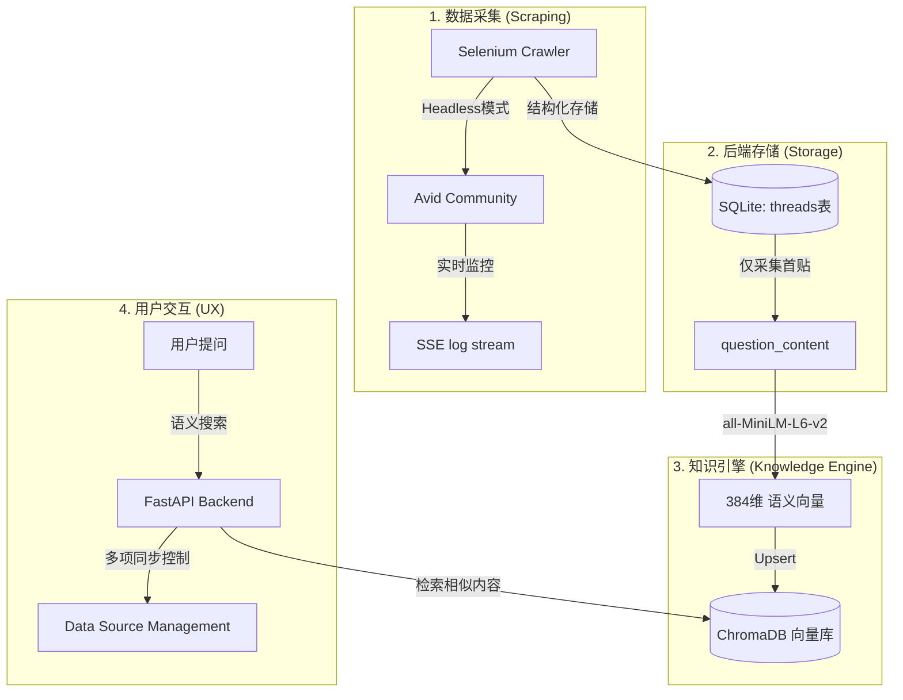

# Avid Media Composer Knowledge Base (RAG)

这是一个基于 **RAG (Retrieval-Augmented Generation / 检索增强生成)** 技术构建的本地知识库系统，专门为 Avid Media Composer 用户提供技术支持。

该系统通过自动化爬虫从 Avid 官方社区获取 20+ 个专业版块的精华讨论，并利用语义向量化技术实现极致精准的故障排除搜索。

## 🏗 技术架构与流程

系统的核心逻辑遵循“采集 -> 结构化 -> 向量化 -> 检索”的流水线：



### 技术栈详细

*   **前端 (Frontend)**
    *   **框架**: [Next.js 14](https://nextjs.org/) (App Router, TypeScript)
    *   **实时更新**: Server-Sent Events (SSE) 协议，实现无刷新的爬虫日志同步。
    *   **UI/UX**: Tailwind CSS 打造的深色模式、玻璃拟态细节。

*   **后端 (Backend)**
    *   **核心 API**: [FastAPI](https://fastapi.tiangolo.com/) (Python 3.9+)
    *   **并发管理**: 特制的线程任务管理器，支持多端、多任务并发控制。

*   **数据检索与 AI (RAG & Search)**
    *   **语义模型**: `all-MiniLM-L6-v2` (Sentence-Transformers)。它像翻译官一样，将技术术语转化为机器可比对的数学坐标（384 维向量）。
    *   **向量库**: [ChromaDB](https://www.trychroma.com/)。负责毫米级的语义检索。
    *   **自动化抓取**: Selenium WebDriver (Headless Chrome)，具备秒级响应的**取消机制**和自动重试功能。

## 📂 项目结构

```text
├── backend/
│   ├── api/                # 后端逻辑 (TaskManager, SSE, Endpoints)
│   ├── crawler/            # 爬虫引擎 (Selenium, db_schema)
│   └── ingest/             # 向量化流程 (vector_store)
├── frontend/               # Next.js 极简风格 UI
├── data/
│   └── chroma_db/          # 向量数据库存储目录
```

## 🚀 核心功能亮点

1.  **多源数据同步**: 在 `Settings` 页面可以对 20 多个论坛分区进行独立管理。
2.  **增量更新 (Incremental)**: 爬虫会自动比对帖子的 `Last Post Date`，仅抓取新出现的内容，大幅节省资源。
3.  **秒级取消控制**: 后端集成了信号量与超时机制，确保用户点击“取消”后，复杂的抓取任务能在秒级内安全中止。
4.  **实时控制台**: 即使在抓取 30,000+ 条数据时，用户也可以通过前端的实时控制台观察爬虫的每一个动作。

## �️ 快速开始

1.  **启动后端**: 
    ```bash
    python3 backend/api/main.py
    ```
    (默认运行在 http://localhost:8000)

2.  **启动前端**: 
    ```bash
    cd frontend && npm run dev
    ```
    (默认运行在 http://localhost:3000)

3.  **抓取数据**: 
    进入 `Settings` 页面，点击任意版块的 `Update Now` 开始同步。

---
> [!TIP]
> **关于 LLM**: 
> 目前系统完成了 RAG 架构中最重要的“知识入库”与“语义检索”部分。
> 在 `Settings` 页面预留了 LLM (GPT-4 / Gemini) 的接口配置，可接入生成模块以实现完整的文档问答功能。
